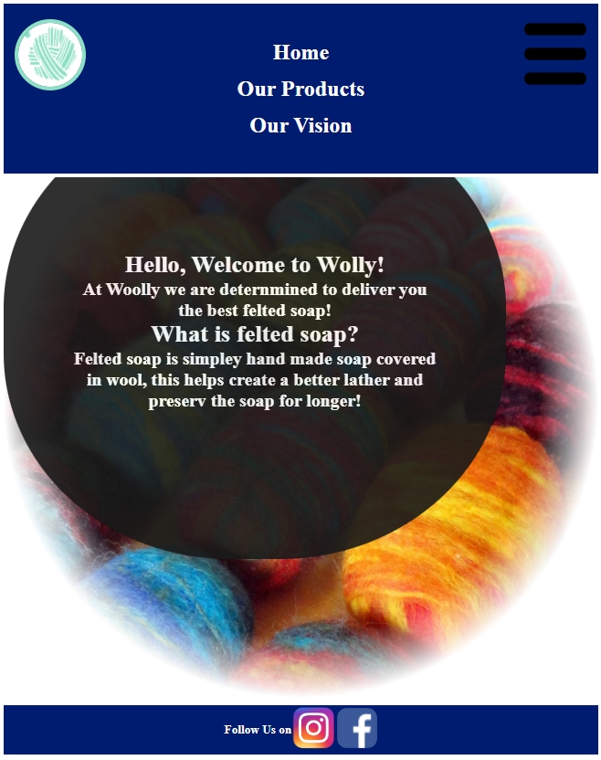
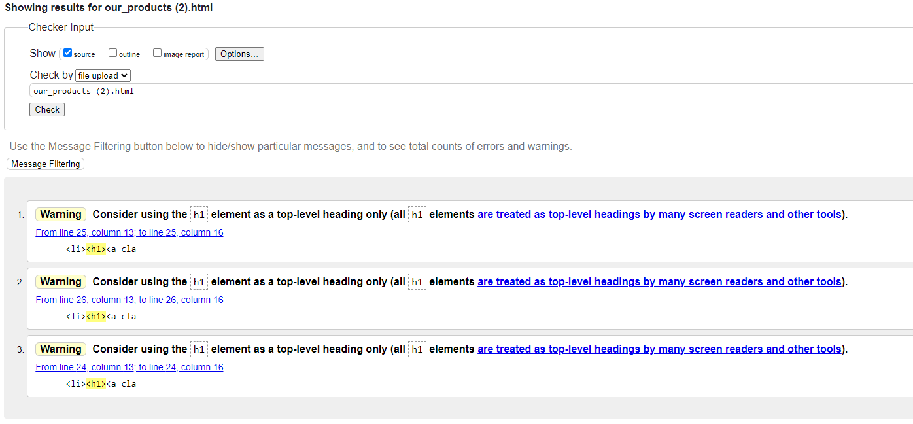

# Woolly Website. 

Your Woolly website is meant to promote and sell the Woolly felted soap. The website will be useful in driving sales for the small company and have easier access to the products.   

### Features.

​	Navigation bar.

    ​	The navigation bar is fixed at the top of the page , this is to facilitate access to the buttons and make navigating the website as easy as possible. The navigation bar is identical on all pages, and features a link to the Homepage on the logo. It is fully responsive and a hamburger menu was added to extend and retract the bar on smaller screens.  

Normal Nav bar.

Reactive nav bar under 720px.

Activated nav bar under 720px.

​   Landing page.

    ​	The landing page has a nice background image of felted soap and a welcome message.

​	Products page.

    ​	The products page showcases the different kinds of felted soap. There is a hover effect on each image to make selection and navigation easy.

​	Our vision.

    ​	The page is meant to inform the customers of the companies purpose and objectives.  

​	The footer.

    ​	Simple footer with where to where else to find the company on social media. The Instagram link opens in a new tab to simplify navigation.

### Features left to implement.

These pages I did not implement yet as I had no input from the person this website is for.  They will be implement when their input is received. 

​	Contacts page.

    ​	Page with a form to fill which will automatically send the response via e-mail to the company.

​	Purchases page.

    ​	A page where purcheses can be made an payment collected trough. 

### Validator testing.

HTML validator no Errors found. 

For index.html and our_products.html there are warnings about using h1 as not a top level element. This is used to save on CSS code by using basic HTML wich gives the text the exact size and shape needed. 

CSS code no Errors found. 

There is a warning however about using -webkit-mask-image as a vendor extension. This could possibly cause some errors on some browsers.

### Deployment.

The website was deployed using Replit. Using Replit is very simple, the website was deployed by inserting all the images, HTML files, CSS files and JS files into the website. Then click Run on the top wich gives an output and provides a link to the deployed website.  
Live link can be found here - [https://Wolly.octimuri.repl.co](https://wolly.octimuri.repl.co/)

### Credits.

All images and videos taken from https://www.instagram.com/yourwoolly/?hl=en.