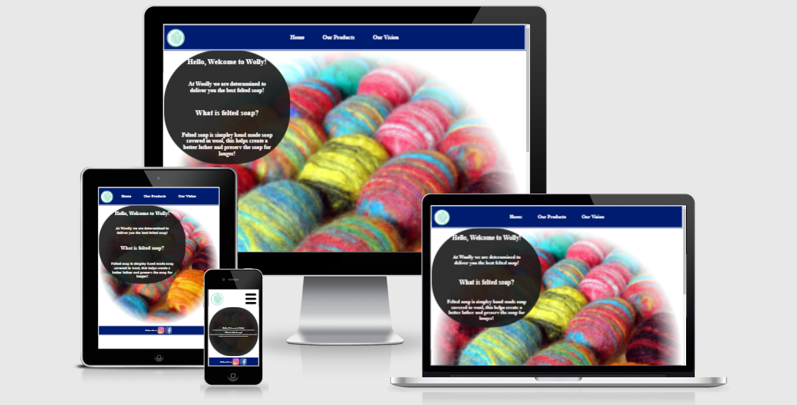
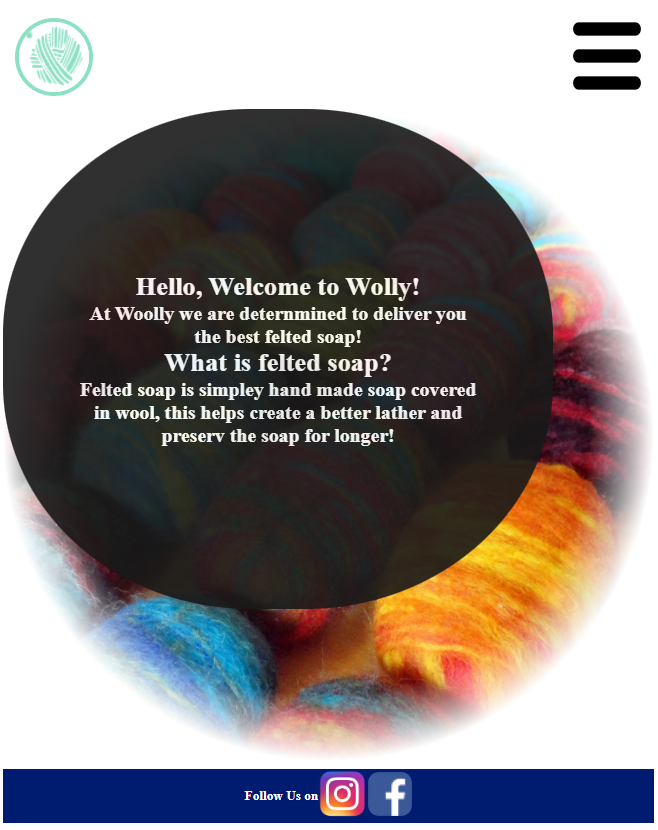
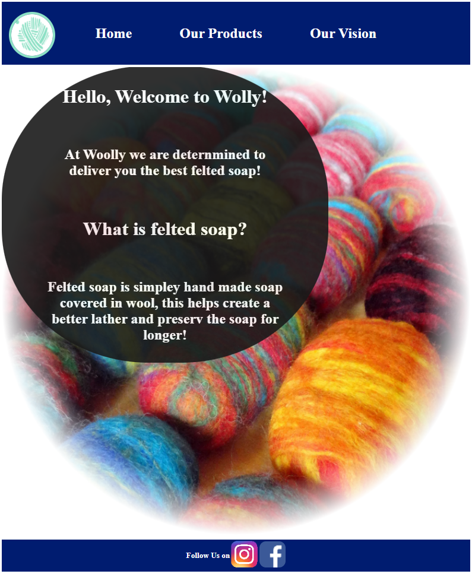
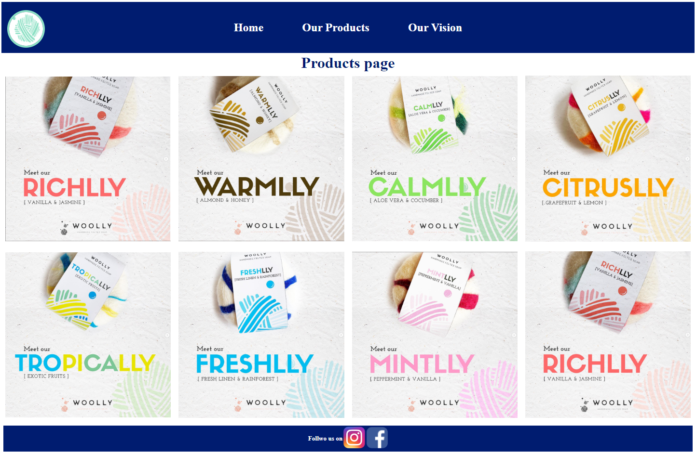
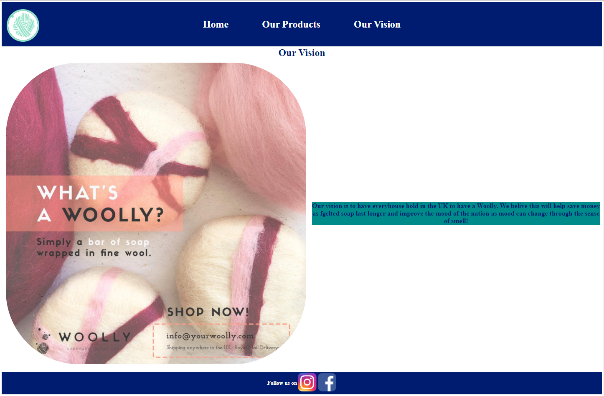

Woolly Website. 

Your Woolly website is meant to promote and sell the Woolly felted soap. The website will be useful in driving sales for the small company and have an easier access to the products.   

Features.

​	Navigation bar.

    ​	The navigation bar is fixed at the top of the page , this is to facilitate access to the buttons and make navigating the website as easy as possible. The navigation bar is identical on all pages, features a link to the Home page on the logo. It is fully responsive and a hamburger menu was added to extend and retract the bar on smaller screens.  

Normal Nav bar.

Reactive nav bar under 720px.

Activated nav bar under 720px.

​   Landing page.

    ​	The landing page has a nice background image of felted soap and a welcome message.

​	Products page.

    ​	The products page showcases the different kinds of felted soap. There is a hover effect on each image to make selection and navigation easy.

​	Our vision.

    ​	The page is meant to infrom the customers of the companies 

​	The footer.

    ​	Simple footer with where to where else to find the company on social media. The Instagram link opens in a new tab to simplify navigation.

Features left to implement.

These pages I did not implement yet as I had no input from the person this website is for.  They will be implement when their input is received. 

​	Contacts page.

    ​	Page with a form to fill which will automatically send the response via e-mail to the company.

​	Purchases page.

    ​	A page where purcheses can be made an payment collected trough. 

Validator testing.

HTML validator no Errors found. 

CSS code no Errors found.

Credits.

All images and videos taken from https://www.instagram.com/yourwoolly/?hl=en.